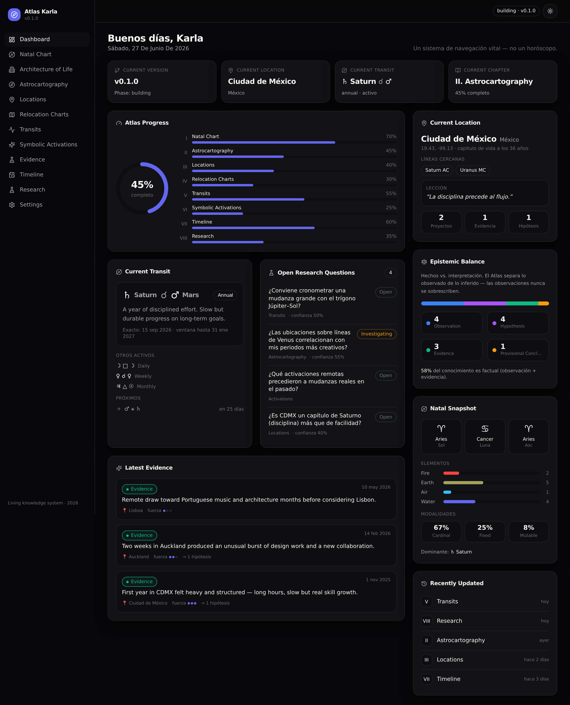
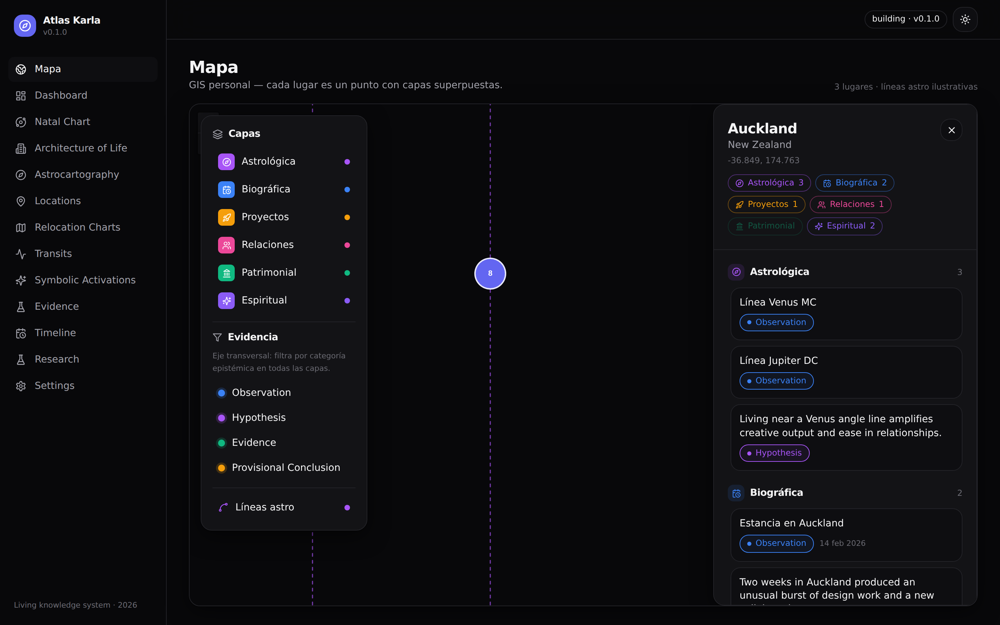

# Atlas Karla

> Un sistema vivo de astrocartografía y navegación vital.
> **No es un horóscopo** — es un repositorio de conocimiento longitudinal para
> apoyar decisiones a largo plazo, reflexión y estrategia.

Este repositorio contiene la **v0.1** del Atlas: el **modelo de datos** (el
núcleo del sistema) y un **dashboard ejecutivo** completo construido sobre él.



---

## Filosofía: hechos vs. interpretación

El Atlas separa estrictamente lo que se **observa** de lo que se **infiere**.
Cada pieza de conocimiento pertenece a exactamente una de cuatro categorías
epistémicas (`src/types/knowledge.ts`):

| Categoría | Qué es | Regla |
|---|---|---|
| **Observation** | Un hecho | Nunca se sobrescribe. Las correcciones se hacen añadiendo una nueva observación. |
| **Hypothesis** | Una conjetura bajo prueba | Se conserva incluso tras ser descartada (`supersededBy`). |
| **Evidence** | Algo vivido | Apoya o refuta hipótesis; nunca "prueba". |
| **Provisional Conclusion** | Entendimiento actual | Siempre revisable. |

> Ninguna interpretación (hipótesis / conclusión) puede sobrescribir una
> observación. El historial de ideas descartadas es parte del Atlas.

## Una sola fuente de verdad

Ningún dato se duplica. La **fecha de nacimiento vive solo en
`src/data/profile.json`**; natal, relocation y tránsitos la referencian. Las
ubicaciones, evidencia, hipótesis y eventos se enlazan por `id`, nunca se
copian. Toda la resolución de referencias vive en `src/lib/atlas.ts` — el único
archivo que cambia cuando migremos de JSON a Supabase.

## Estructura

```
src/
├── types/        # Modelo de datos tipado (knowledge.ts = el núcleo)
├── data/         # Datastore JSON (sample data — reemplazar con datos reales)
├── lib/          # Capa de acceso a datos + glifos + formato
├── components/   # UI: sidebar, primitivas y widgets del dashboard
└── pages/        # Dashboard + placeholders de capítulos
```

Los nueve dominios de datos (`natal`, `astrocartography`, `locations`,
`relocation`, `transits`, `hypotheses`, `evidence`, `activations`, `timeline`)
están modelados en `src/types/atlas.ts`.

## El Mapa (GIS personal)

La pantalla principal es un **mapa interactivo** (Leaflet) donde cada lugar es un
punto con **capas superpuestas**: astrológica, biográfica, proyectos, relaciones,
patrimonial y espiritual. Las capas son *temas*; la **evidencia** no es una capa,
sino un **eje transversal** — un filtro por categoría epistémica que atraviesa
todas las capas. Las líneas de astrocartografía son por ahora **ilustrativas**
(el cálculo real es una fase posterior). Ver `src/pages/MapPage.tsx` y
`src/lib/layers.ts`.



## El Dashboard

La landing se comporta como un panel ejecutivo y muestra los ocho bloques del
documento maestro: **Current Version, Current Location, Current Transit,
Current Chapter, Atlas Progress, Open Research Questions, Latest Evidence** y
**Recently Updated Chapters** — más un widget de **Epistemic Balance** que hace
visible la filosofía (cuánto del sistema es factual vs. interpretativo) y un
**Natal Snapshot**.

## Desarrollo

```bash
npm install
npm run dev        # servidor de desarrollo
npm run build      # typecheck + build de producción
npm run preview    # previsualizar el build
```

**Stack:** React 19 · TypeScript · Tailwind CSS v4 · Vite. JSON como datastore
inicial (migración futura a Supabase). Diseño minimalista tipo Apple, con modo
claro y oscuro y layout responsive.

## Datos de ejemplo

Los archivos en `src/data/` contienen **datos de muestra** para que el sistema
funcione de inmediato. Reemplázalos con datos reales empezando por
`profile.json` (fecha, hora y lugar de nacimiento).

## Roadmap

- **v0.x — Building (actual):** modelo de datos + dashboard.
- **v1.x — Stable:** los ocho capítulos navegables.
- **v2.x — Expansion:** mapas interactivos (Leaflet/Mapbox), analítica y la
  capa de IA de navegación ("Estoy pensando mudarme a Lisboa el próximo año").
